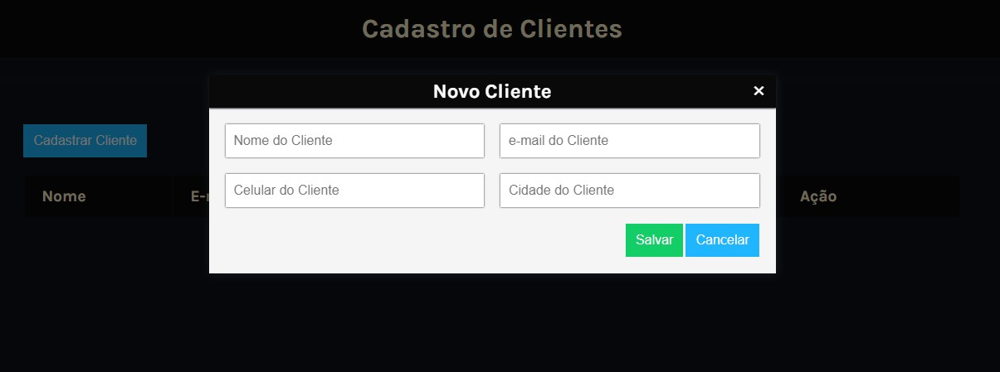

# CRUD

##   Indice
📋

- <a href="#sobre-o-projeto">Sobre o Projeto</a>
- <a href="#objetivos">Objetivos</a>
- <a href="#funcionalidades">Funcionalidades</a>
- <a href="#captura-de-tela">Capitura de Tela</a>
- <a href="#linguagens-utilizadas">Linguagens utilizadas</a>
- <a href="#o-que-eu-aprendi">O que eu aprendi</a>
- <a href="#melhorias-na-aplicação">Melhorias na aplicação</a>
- <a href="#lista-de-implementações">Lista de implementações</a>
- <a href="#recursos-úteis">Recursos úteis</a>
- <a href="#autor">Autor</a>

##  Sobre o Projeto

 O Projeto tem como prioridade Conhecer novas maneiras de usar funções e também melhorar meus conhecimentos em CRUD.
 Aprender as rotinas para se construir um CRUD.

 <a href="#indice">Indice</a>

##  Objetivos
Aprender melhor rotinas de um CRUD.
Aprender como tratar as rotinas do CRUD, creat, read, update, delete.
Melorar e Aprender o uso do LocalStorage.

## Funcionalidades

 <a href="#indice">Indice</a>

## Captura de tela 
📸

#### CRUD com LcalStorage

 <a href="#indice">Indice</a>

## Demonstração

[Link Demontração](<a href="https://mini-crud-2024.netlify.app/">mini-crud-2024</a>)

## Linguagens utilizadas
📝
HTML | CSS | JavaScript

 <a href="#indice">Indice</a>

###  O que eu aprendi
🤓

- Trabalhar nas rotinas necessárias para o uso do localStorage.

 <a href="#indice">Indice</a>

## Melhorias na aplicação
- Trocar o nome da modal quando estiver Editando.
- Implementar o dark mode.

 <a href="#indice">Indice</a>

## Lista de implementações

 <a href="#indice">Indice</a>

###   Recursos Úteis
🔧
- 

 <a href="#indice">Indice</a>

##   Autor
🧑‍💻
- <a href="https://www.youtube.com/watch?v=_HEIqE_qqbQ" target="_blank" rel="noopener noreferrer">Prof. Fernando Leonid</a>

 <a href="#indice">Indice</a>

### Vanderlei Junior
- <a href="https://vanderleijunior.netlify.app/" target="_blank">Portifólio</a>
- <a href="https://github.com/VanderleiGeronimoJunior" target="_blank">GitHub</a>
- <a href="https://www.linkedin.com/in/vanderlei-junior-b9956686/" target="_blank">Linkedin</a>

 <a href="#indice">Indice</a>

